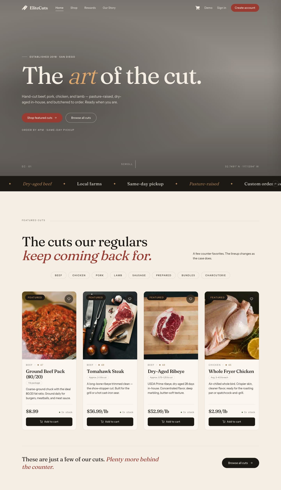
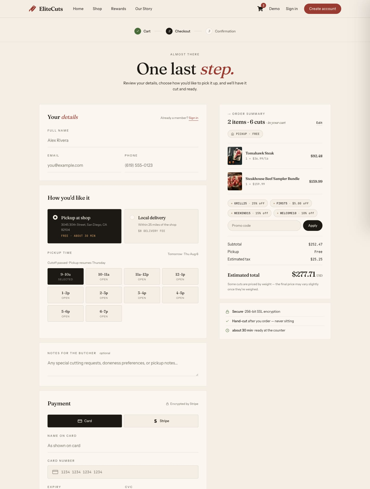
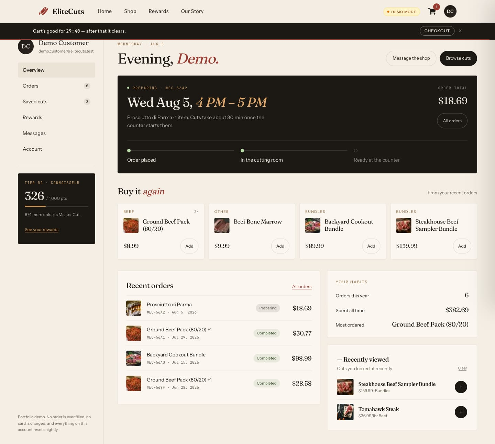
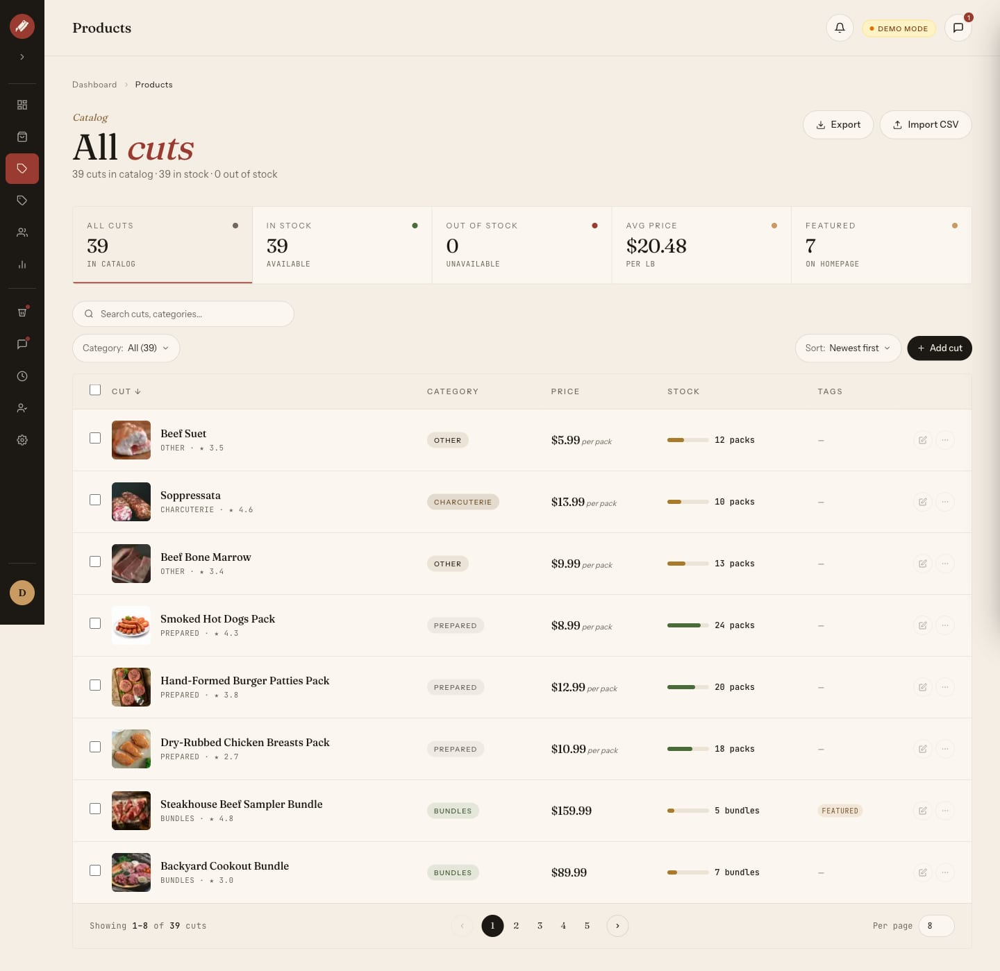

# EliteCuts

**Premium Online Butcher Shop** — order ahead, pick up fresh.

EliteCuts is a full-stack web application that gives a local butcher shop a modern storefront: authenticated customers browse cuts, build a cart, pay via Stripe, and schedule a pickup. Admins manage products, orders, and users through a dashboard.

This repository is a **TypeScript redesign** of the original JavaScript app — same core idea, rebuilt with strict types, a modernized stack, and an editorial UI.

---

## Table of Contents

- [Features](#features)
- [Screenshots](#screenshots)
- [Tech Stack](#tech-stack)
- [Project Structure](#project-structure)
- [Data Models](#data-models)
- [API Routes](#api-routes)
- [Getting Started](#getting-started)
- [Environment Variables](#environment-variables)
- [Auth Flow](#auth-flow)
- [Checkout Flow](#checkout-flow)

---

## Features

**Customer**
- Browse products by category (Beef, Chicken, Pork, Lamb, Sausage, Prepared, Bundles, Charcuterie, Other)
- View product detail with image gallery (PhotoSwipe)
- Guest checkout or authenticated cart with rewards
- Stripe Checkout with pickup time selection (test mode only — this is a portfolio demo)
- Promo codes, points-based rewards, and tier retention
- Save/unsave cuts to a personal favorites list
- Profile management: name, email, password, addresses, order history

**Admin**
- Full product CRUD with Cloudinary image upload
- Mark products featured, aged, or new arrival
- View and manage all users
- View and update order status (Pending → Ready for Pickup → Completed)
- Dashboard with sales and inventory metrics

**UX**
- Mobile-first responsive layout
- Warm editorial aesthetic (Fraunces + Instrument Sans + JetBrains Mono)
- Animated hero, featured product grid, marquee strip
- Toast notifications via Sonner

---

## Screenshots

**Editorial homepage** — hero, marquee, and the featured grid



**Product detail** — gallery, weight-aware pricing, category-aware cooking notes


**Cart drawer** — item and cut counts, bundle contents, estimated total


**Checkout** — pickup slots drawn from real shop hours, promo and points



**Account dashboard** — the order in progress, reorder strip, and habits



**Admin dashboard** — the day's cut list, not a monthly report


**Admin catalog** — stat strip, stock bars, per-pricing-type units, CSV import/export



**Mobile catalog (iPhone 12 Pro)**


---

## Tech Stack

| Layer | Choice | Version |
|---|---|---|
| Framework | Next.js (App Router) | ^16.3.0 |
| Language | TypeScript (strict mode) | ^6.0.3 |
| UI Library | React | ^19.2.8 |
| Styling | Tailwind CSS v4 | ^4.2.4 |
| Icons | React Icons | ^5.7.0 |
| Database | MongoDB Atlas + Mongoose | ^9.9.1 |
| Auth | NextAuth.js | ^4.24.15 |
| Image Hosting | Cloudinary | ^2.10.0 |
| Payments | Stripe | ^22.4.0 |
| Validation | Zod | ^4.4.3 |
| Testing | Vitest | ^4.1.10 |
| Notifications | Sonner | ^2.0.7 |
| Image Gallery | PhotoSwipe | ^5.4.4 |
| Deployment | Vercel | — |

---

## Project Structure

```
src/
├── app/
│   ├── (auth)/             # Login, Register pages
│   ├── (main)/             # Customer-facing pages
│   │   ├── page.tsx        # Home
│   │   ├── products/       # Catalog + [slug] detail
│   │   ├── cart/
│   │   ├── checkout/       # + confirmation, stripe-mock
│   │   ├── profile/
│   │   ├── receipt/[id]/
│   │   ├── rewards/
│   │   ├── our-story/
│   │   ├── contact/
│   │   ├── demo/           # Demo account landing
│   │   ├── privacy/
│   │   └── terms/
│   ├── (admin)/dashboard/  # Admin shell — orders, products, customers,
│   │                       # inventory, promos, analytics, messages,
│   │                       # schedule, staff, settings
│   └── api/                # API route handlers
├── components/
│   ├── ui/                 # Generic primitives — SelectField, Accordion, Reveal
│   │   └── icons/          # Shared icon set (ArrowIcon, CheckIcon, …)
│   ├── admin/              # Admin shell + one folder per dashboard tab
│   └── [feature]/          # cart, checkout, product, profile, navbar,
│                           # footer, home, our-story, rewards, legal,
│                           # demo, auth, holiday, grill-event
├── lib/
│   ├── [feature]/          # Domain logic paired with its components folder —
│   │                       # orders, products, promos, checkout, payments,
│   │                       # rewards, admin, auth, shop-settings, demo, …
│   └── *.ts                # Cross-domain helpers (money, pricing, format,
│                           # api-handler, rateLimit, styles, validation)
├── models/                 # Mongoose schemas (User, Product, Order, Cart, …)
├── config/                 # DB connection, Cloudinary setup
├── hooks/                  # useHandleAddToCart, useCartExpiry, useReveal, …
│   └── admin/              # Dashboard-only hooks (table state, bulk actions)
├── context/                # CartContext, CheckoutContext, ShopSettingsContext
├── actions/                # Server Actions (addresses, promos)
├── jobs/                   # The dormancy scan (other cron bodies live in lib/)
├── types/                  # Shared types + next-auth module augmentation
└── assets/images/          # Imported (non-public) images
```

Two conventions worth knowing: a feature's UI lives in `components/[feature]/`
and its logic in the matching `lib/[feature]/`, and tests sit next to the file
they cover as `*.test.ts` rather than in a separate tree.

---

## Data Models

### User
```ts
{
  name: string
  email: string           // unique, lowercase
  password?: string       // bcrypt hash; optional for OAuth users
  savedCuts: ObjectId[]   // refs to Product
  addresses: Address[]    // embedded subdocuments
  isAdmin: boolean        // immutable after creation
}
```

### Product
```ts
{
  name: string
  slug: string            // stable URL key, survives renames
  category: 'Beef' | 'Chicken' | 'Pork' | 'Lamb' | 'Sausage' | 'Prepared' | 'Bundles' | 'Charcuterie' | 'Other'
  description: string
  pricingType: 'fixed' | 'per_lb' | 'whole' | 'individual' | 'bundle'
  price: number           // cents (estimate for per_lb / whole)
  displayPriceLabel: string   // e.g. "$24.99/lb"
  displayWeightLabel: string  // e.g. "Typically 12-14 oz"
  images: string[]        // Cloudinary URLs (admin uploads) or seeded filenames
  stockCount: number
  isFeatured: boolean
  isAged: boolean
  isNewArrival: boolean
  isActive: boolean       // soft-delete flag
  rating: number          // 0–5
}
```

### Cart
```ts
{
  user: ObjectId          // unique — one cart per user
  items: {
    product: ObjectId
    quantity: number      // min: 1
    price: number         // snapshot at add time
  }[]
}
```

### Order
```ts
{
  user: ObjectId
  orderItems: { product, name, qty, image, price, productType }[]
  subtotal: number
  tax: number
  totalCost: number
  orderStatus: 'Pending' | 'Ready for Pickup' | 'Completed' | 'Cancelled'
  paymentMethod: 'Credit Card' | 'Stripe'  // Credit Card = no-charge demo tile
  paymentResult: { status, transactionId?, amountPaid, currency, paymentDate }
  pickupLocation: string
  isPaid: boolean
  pickedUp: boolean
}
```

### Review
```ts
{
  user: ObjectId
  product: ObjectId
  rating: number          // 1–5
  comment: string         // max 1000 chars
  // compound unique index: one review per user per product
}
```

---

## API Routes

The core domains are below. The full surface is larger (53 handlers) — checkout
and Stripe webhooks, orders, promos, reviews, messages, staff, shifts, events,
inventory/deliveries/stocktakes, notifications, settings, CSV import/export and
the cron jobs all have their own routes under `src/app/api/`. `vercel.json` is
the authoritative list of what runs on a schedule and when — three jobs, all
behind the same bearer gate.

### Auth
| Method | Route | Description |
|---|---|---|
| POST | `/api/auth/register` | Register new user |
| * | `/api/auth/[...nextauth]` | NextAuth handler |

### Products
| Method | Route | Description |
|---|---|---|
| GET | `/api/products` | List all products |
| POST | `/api/products` | Create product (admin) |
| GET | `/api/products/[id]` | Get single product |
| PUT | `/api/products/[id]` | Update product (admin) |
| DELETE | `/api/products/[id]` | Delete product (admin) |
| GET | `/api/products/by-slug` | Resolve a product by its durable slug |

### Cart
| Method | Route | Description |
|---|---|---|
| GET | `/api/cart` | Get user's cart |
| POST | `/api/cart` | Add a cart item |
| PATCH | `/api/cart` | Update a cart item's quantity |
| DELETE | `/api/cart` | Remove cart item |

### Saved Cuts
| Method | Route | Description |
|---|---|---|
| GET | `/api/saved-cuts` | Get user's saved cuts |
| POST | `/api/saved-cuts` | Save or unsave a product |
| POST | `/api/saved-cuts/check` | Check if a product is saved |

### Users (Admin)
| Method | Route | Description |
|---|---|---|
| GET | `/api/users` | List all users |
| POST | `/api/users` | Create user |
| GET | `/api/users/[id]` | Get user by ID |
| PUT | `/api/users/[id]` | Update user by ID |
| PATCH | `/api/users/[id]` | Cancel a pending deletion or dormancy warning |
| DELETE | `/api/users/[id]` | Delete user by ID |

There is no aggregate `/api/dashboard` endpoint — admin pages read from MongoDB
directly in their server components. Settings is the one exception, reading and
writing shop config through `/api/settings`.

---

## Getting Started

### Prerequisites

- Node.js 20+
- MongoDB Atlas cluster (or local MongoDB)
- Cloudinary account
- Stripe account

### Install

```bash
git clone <repo-url>
cd elite-cuts
npm install
```

### Develop

```bash
npm run dev       # http://localhost:3000
npm run build     # production build
npm run start     # start production server
npm run lint      # ESLint
npm run typecheck # TypeScript
npm test          # Vitest suite
npm run format    # Prettier
```

---

## Environment Variables

Copy `.env.example` to `.env` and fill in every value:

```bash
cp .env.example .env
```

```env
MONGODB_URI=mongodb+srv://<user>:<password>@<cluster>.mongodb.net/elite-cuts-dev
NEXTAUTH_URL=http://localhost:3000  # next-auth reads this itself, not src
NEXTAUTH_SECRET=                    # openssl rand -base64 32

CLOUDINARY_CLOUD_NAME=
CLOUDINARY_API_KEY=
CLOUDINARY_API_SECRET=

STRIPE_SECRET_KEY=                  # test-mode only (sk_test_...); unset = local stub
STRIPE_WEBHOOK_SECRET=

CRON_SECRET=                        # shared bearer for all three cron endpoints (dormancy, purge, demo reset)

NEXT_PUBLIC_SITE_URL=

ENABLE_DEMO_CARD_TILE=              # 'true' enables the no-charge demo checkout tile
```

### Which database each environment uses

One Atlas cluster, one database per environment, selected by the path segment of
`MONGODB_URI` — that value **is** the separation, so it is worth being deliberate
about:

| Environment | Database         |
| ----------- | ---------------- |
| Production  | `elite-cuts`     |
| Preview     | `elite-cuts-dev` |
| Local       | `elite-cuts-dev` |

Set these per environment in Vercel. Only Production should ever point at
`elite-cuts`; before 2026-08-08 local and production shared it, which made every
local write a production write.

Two consequences worth knowing before pointing at a fresh database:

- **It starts empty, and an empty database renders an empty shop.** Seeding is
  not a single command — the seed scripts live outside the repository, and the
  one that looks like the obvious all-in-one writes a product shape that predates
  the current pricing model, which makes every product page 404.
- **Indexes build themselves, but per model and lazily.** `autoIndex` is on in
  every environment, so there is no deploy-time index step — but `Model.init()`
  fires when a model module is first imported, not at connect, so indexes appear
  as routes are exercised rather than all at once. A failed build is swallowed
  silently, so read the database back rather than trusting a quiet startup.

---

## Auth Flow

```
User → /login → NextAuth Credentials Provider
                ↓
          bcrypt.compare(password, hash)
                ↓
          JWT session { userId, isAdmin }
                ↓
    Middleware checks role → /dashboard (admin) or /products (customer)
```

- Passwords are hashed with bcryptjs (max length: 128 chars)
- Session data is stored in a signed JWT (not a database session)
- `isAdmin` is set at registration and is immutable
- Guests can browse, build a cart, and check out; signing in adds rewards,
  saved cuts, and order history. Registering with the email used on a guest
  order claims that order into the new account
- Two seeded demo accounts sign in from `/demo` in one click, with no password
  sent to the browser. Their state is restored nightly

---

## Checkout Flow

```
Cart → Review details, pickup slot, promo/points
                       ↓
       Write Order (orderStatus: Pending, isPaid: false)
       — no stock decrement, no points deducted yet
                       ↓
               Create Stripe Checkout Session
                       ↓
               Stripe-hosted checkout page
                       ↓
       Stripe webhook flips that same order → isPaid: true
       — decrements stock, settles points and the promo seat,
         idempotent so a retried webhook can't double-apply
                       ↓
               Confirmation page
```

The order is written *before* the redirect and the webhook updates it, rather
than the webhook creating it — so an abandoned checkout leaves a Pending row
rather than nothing. Payment state lives on `isPaid` and `paymentResult`;
`orderStatus` tracks fulfillment (Pending → Ready for Pickup → Completed).

Without `STRIPE_SECRET_KEY` set, checkout routes through a local stub that
mirrors the same complete/cancel paths, so the flow works end to end with no
Stripe credentials.

Fulfillment is pickup-only. No shipping in the current version.
