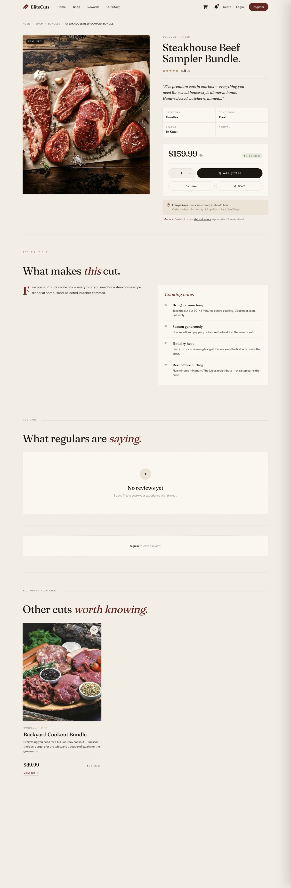
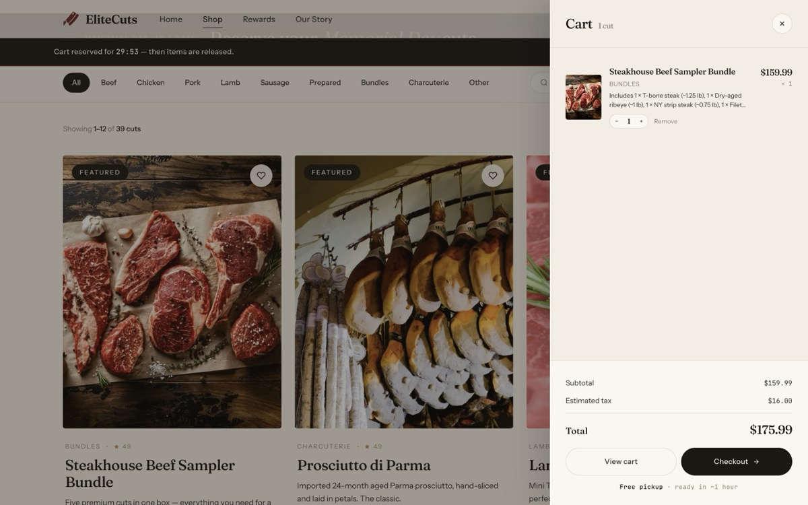
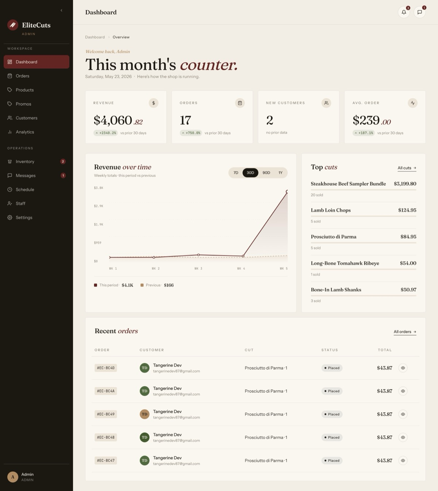
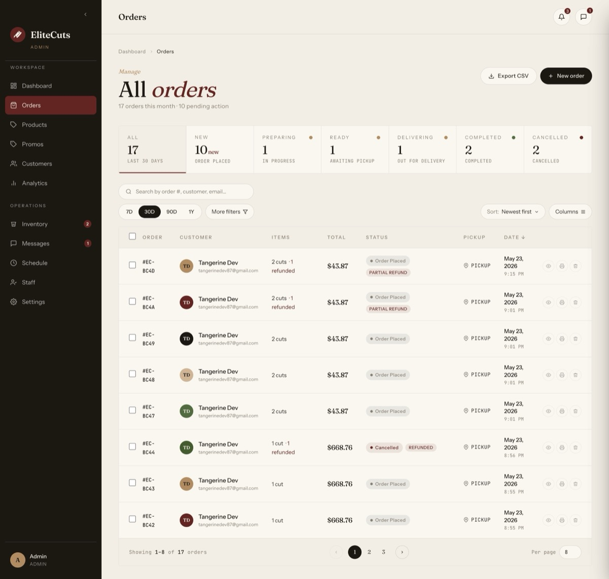
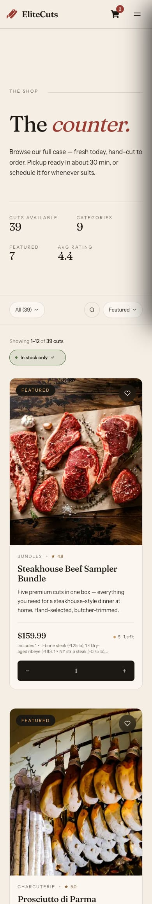

# EliteCuts

**Premium Online Butcher Shop** — order ahead, pick up fresh.

EliteCuts is a full-stack web application that gives a local butcher shop a modern storefront: authenticated customers browse cuts, build a cart, pay via Stripe, and schedule a pickup. Admins manage products, orders, and users through a dashboard.

This repository is a **TypeScript redesign** of the original JavaScript app — same core idea, rebuilt with strict types, a modernized stack, and an editorial UI.

---

## Table of Contents

- [Features](#features)
- [Screenshots](#screenshots)
- [Tech Stack](#tech-stack)
- [Project Structure](#project-structure)
- [Data Models](#data-models)
- [API Routes](#api-routes)
- [Getting Started](#getting-started)
- [Environment Variables](#environment-variables)
- [Auth Flow](#auth-flow)
- [Checkout Flow](#checkout-flow)

---

## Features

**Customer**
- Browse products by category (Beef, Chicken, Pork, Charcuterie, Sausage, Prepared, Bundles, Other)
- View product detail with image gallery (PhotoSwipe)
- Guest checkout or authenticated cart with rewards
- Stripe Checkout with pickup time selection (test mode only — this is a portfolio demo)
- Promo codes, points-based rewards, and tier retention
- Save/unsave cuts to a personal favorites list
- Profile management: name, email, password, addresses, order history

**Admin**
- Full product CRUD with Cloudinary image upload
- Mark products featured, aged, or new arrival
- View and manage all users
- View and update order status (Pending → Ready for Pickup → Completed)
- Dashboard with sales and inventory metrics

**UX**
- Mobile-first responsive layout
- Warm editorial aesthetic (Fraunces + Instrument Sans + JetBrains Mono)
- Animated hero, featured product grid, marquee strip
- Toast notifications via Sonner

---

## Screenshots

**Editorial homepage**


**Product detail — realistic per-pound and bundle pricing**



**Cart drawer — subtotal, estimated tax, total, free pickup ETA**



**Admin dashboard — KPIs, revenue chart, top cuts, recent orders**



**Admin orders — filter, search, sort, column visibility**



**Mobile catalog (iPhone 12 Pro)**



---

## Tech Stack

| Layer | Choice | Version |
|---|---|---|
| Framework | Next.js (App Router) | ^16.2.4 |
| Language | TypeScript (strict mode) | ^6.0.3 |
| UI Library | React | ^19.2.5 |
| Styling | Tailwind CSS v4 | ^4.2.4 |
| UI Primitives | Headless UI | ^2.2.10 |
| Icons | React Icons | ^5.6.0 |
| Database | MongoDB Atlas + Mongoose | ^9.6.1 |
| Auth | NextAuth.js | ^4.24.14 |
| Image Hosting | Cloudinary | ^2.10.0 |
| Payments | Stripe | — |
| Validation | Zod | ^4.4.3 |
| Testing | Vitest | ^4.1.6 |
| Notifications | Sonner | ^2.0.7 |
| Image Gallery | react-photoswipe-gallery | ^4.0.0 |
| Deployment | Vercel | — |

---

## Project Structure

```
src/
├── app/
│   ├── (auth)/             # Login, Register pages
│   ├── (main)/             # Customer-facing pages
│   │   ├── page.tsx        # Home
│   │   ├── products/       # Catalog + detail
│   │   ├── cart/
│   │   ├── checkout/
│   │   ├── profile/
│   │   ├── rewards/
│   │   ├── demo/           # Demo account landing
│   │   ├── privacy/
│   │   └── terms/
│   ├── (admin)/dashboard/  # Admin shell — orders, products, customers,
│   │                       # inventory, promos, analytics, messages,
│   │                       # schedule, staff, settings
│   └── api/                # API route handlers
├── components/             # Feature-organized React components
├── models/                 # Mongoose schemas (User, Product, Order, Cart, Review)
├── config/                 # DB connection, Cloudinary setup
├── utils/                  # Auth options, session helpers, form parsing
├── hooks/                  # useHandleAddToCart, useHandleBookmark, useReveal
├── actions/                # Server Actions (checkout, addresses)
├── context/                # CartContext, CheckoutContext, GlobalContext
├── lib/                    # Validation helpers, pricing, style utilities
└── types/                  # TypeScript type extensions (next-auth.d.ts, address.ts)
```

---

## Data Models

### User
```ts
{
  name: string
  email: string           // unique, lowercase
  password?: string       // bcrypt hash; optional for OAuth users
  savedCuts: ObjectId[]   // refs to Product
  addresses: Address[]    // embedded subdocuments
  isAdmin: boolean        // immutable after creation
}
```

### Product
```ts
{
  name: string
  slug: string            // stable URL key, survives renames
  category: 'Beef' | 'Chicken' | 'Pork' | 'Charcuterie' | 'Sausage' | 'Prepared' | 'Bundles' | 'Other'
  description: string
  pricingType: 'fixed' | 'per_lb' | 'whole' | 'individual' | 'bundle'
  price: number           // cents (estimate for per_lb / whole)
  displayPriceLabel: string   // e.g. "$24.99/lb"
  displayWeightLabel: string  // e.g. "Typically 12-14 oz"
  images: string[]        // Cloudinary URLs (admin uploads) or seeded filenames
  stockCount: number
  isFeatured: boolean
  isAged: boolean
  isNewArrival: boolean
  isActive: boolean       // soft-delete flag
  rating: number          // 0–5
}
```

### Cart
```ts
{
  user: ObjectId          // unique — one cart per user
  items: {
    product: ObjectId
    quantity: number      // min: 1
    price: number         // snapshot at add time
  }[]
}
```

### Order
```ts
{
  user: ObjectId
  orderItems: { product, name, qty, image, price, productType }[]
  subtotal: number
  tax: number
  totalCost: number
  orderStatus: 'Pending' | 'Ready for Pickup' | 'Completed' | 'Cancelled'
  paymentMethod: 'Credit Card' | 'Stripe'  // Credit Card = no-charge demo tile
  paymentResult: { status, transactionId?, amountPaid, currency, paymentDate }
  pickupLocation: string
  isPaid: boolean
  pickedUp: boolean
}
```

### Review
```ts
{
  user: ObjectId
  product: ObjectId
  rating: number          // 1–5
  comment: string         // max 1000 chars
  // compound unique index: one review per user per product
}
```

---

## API Routes

### Auth
| Method | Route | Description |
|---|---|---|
| POST | `/api/auth/register` | Register new user |
| * | `/api/auth/[...nextauth]` | NextAuth handler |

### Products
| Method | Route | Description |
|---|---|---|
| GET | `/api/products` | List all products |
| POST | `/api/products` | Create product (admin) |
| GET | `/api/products/[id]` | Get single product |
| PUT | `/api/products/[id]` | Update product (admin) |
| DELETE | `/api/products/[id]` | Delete product (admin) |
| GET | `/api/products/featured` | Get featured products |

### Cart
| Method | Route | Description |
|---|---|---|
| GET | `/api/cart` | Get user's cart |
| POST | `/api/cart` | Add or update cart item |
| DELETE | `/api/cart` | Remove cart item |

### Saved Cuts
| Method | Route | Description |
|---|---|---|
| GET | `/api/saved-cuts` | Get user's saved cuts |
| POST | `/api/saved-cuts` | Save or unsave a product |
| POST | `/api/saved-cuts/check` | Check if a product is saved |

### Users (Admin)
| Method | Route | Description |
|---|---|---|
| GET | `/api/users` | List all users |
| POST | `/api/users` | Create user |
| DELETE | `/api/users` | Delete user |
| GET | `/api/users/[id]` | Get user by ID |
| PUT | `/api/users/[id]` | Update user by ID |

### Admin
| Method | Route | Description |
|---|---|---|
| GET | `/api/dashboard` | Dashboard statistics |

---

## Getting Started

### Prerequisites

- Node.js 20+
- MongoDB Atlas cluster (or local MongoDB)
- Cloudinary account
- Stripe account

### Install

```bash
git clone <repo-url>
cd elite-cuts
npm install
```

### Develop

```bash
npm run dev       # http://localhost:3000
npm run build     # production build
npm run start     # start production server
npm run lint      # ESLint
npm run typecheck # TypeScript
npm test          # Vitest suite
npm run format    # Prettier
```

---

## Environment Variables

Copy `.env.example` to `.env` and fill in every value:

```bash
cp .env.example .env
```

```env
MONGODB_URI=mongodb+srv://<user>:<password>@<cluster>.mongodb.net/<dbname>
NEXT_PUBLIC_DOMAIN=http://localhost:3000
NEXTAUTH_SECRET=                    # openssl rand -base64 32

CLOUDINARY_CLOUD_NAME=
CLOUDINARY_API_KEY=
CLOUDINARY_API_SECRET=

STRIPE_SECRET_KEY=                  # test-mode only (sk_test_...); unset = local stub
STRIPE_WEBHOOK_SECRET=

CRON_SECRET=                        # shared bearer for dormancy + purge cron endpoints

NEXT_PUBLIC_API_URL=
NEXT_PUBLIC_SITE_URL=

ENABLE_DEMO_CARD_TILE=              # 'true' enables the no-charge demo checkout tile
```

---

## Auth Flow

```
User → /login → NextAuth Credentials Provider
                ↓
          bcrypt.compare(password, hash)
                ↓
          JWT session { userId, isAdmin }
                ↓
    Middleware checks role → /dashboard (admin) or /products (customer)
```

- Passwords are hashed with bcryptjs (max length: 128 chars)
- Session data is stored in a signed JWT (not a database session)
- `isAdmin` is set at registration and is immutable
- Only authenticated users can add to cart or check out

---

## Checkout Flow

```
Cart → auth check → Review order
                       ↓
               Create Stripe Checkout Session
                       ↓
               Stripe-hosted checkout page
                       ↓
               Stripe webhook → create Order (status: Paid)
                       ↓
               Confirmation page
```

Fulfillment is pickup-only. No shipping in the current version.
